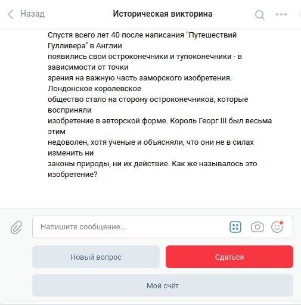

# HistoryQuiz
History Quiz Bot developed for a training course Devman (project 4, module Chatbots)
Try it, writing to: Telegram channel @history_quiz_123_bot or [VK group](https://vk.com/public198736597). Both bots are deployed on [Heroku](heroku.com) and are available rigth now!

 

# About
Telegram and VK bots parse questions from TXT file and use free [redis database](https://redislabs.com/) to store current question for user by chat ID.

# How to install
To customize bots you need some keys that are:
- `TG_TOKEN`: create your own bot writing to BotFather @BotFather,
- `VK_TOKEN`: create your group with bot in [VK](https://vk.com/dev/bots),
- `DB_HOST`, `DB_PORT`, `DB_PASSWORD`: get [RedisLabs](https://redislabs.com/) database host, port and password  while creating new database.

Python 3 should be already installed. Then use pip3 (or pip) to install dependencies:

```bash
pip3 install -r requirements.txt
```

# How to launch
The Example of launch in Ubuntu is:

```bash
$ python3 tg_bot.py 
$ python3 vk_bot.py 
```
Quiz text file example:
```txt
Чемпионат:
III Открытый Кубок России по ЧГК

URL:
/znatoki/boris/reports/200112CupRoss.html

Дата:
02-Dec-2001

Тур:
1 тур

Вопрос 1:
Газета "Известия" регулярно проводит опросы, задавая разным людям один и
тот же вопрос на злобу дня. Например, в октябре на вопрос, чем
отличается ПЕРВАЯ от ВТОРОЙ, в числе прочих был получен ответ: "Одна -
русская писательница, а другая - греческая богиня". Назовите и ту, и
другую.

Ответ:
"ТЭФИ" и "Ника" (принимается также и таком написании: Тэффи и Ника).

Комментарий:
Опрос был приурочен к вручению ТЭФИ.

Источник:
Газета "Известия". 2001. 27 октября.

Автор:
Елена Орлова (Москва)

Вопрос 2:
Она выдает себя за оазис, или за постоялый двор, или за колодец, и в
Америке встречается всегда и везде - как ягоды на поляне, как кочки на
болотах, как трава в поле, как микробы в воздухе. Наконец, последняя из
фальшивых аналогий - колодец, но не с живой, а с мертвой водой. О чем
так написал Александр Генис?

Ответ:
О бензоколонке
```

It is better to launch the script on a remote server, [Heroku](https://devcenter.heroku.com/articles/how-heroku-works), for example. It provides that it will work around the clock. A "Procfile" is need to launch correctly on Heroku.

# Project Goals

The code is written for educational purposes on online-course for web-developers dvmn.org, module [Chat Bots with Python](https://dvmn.org/modules/chat-bots/lesson/support-bot).
